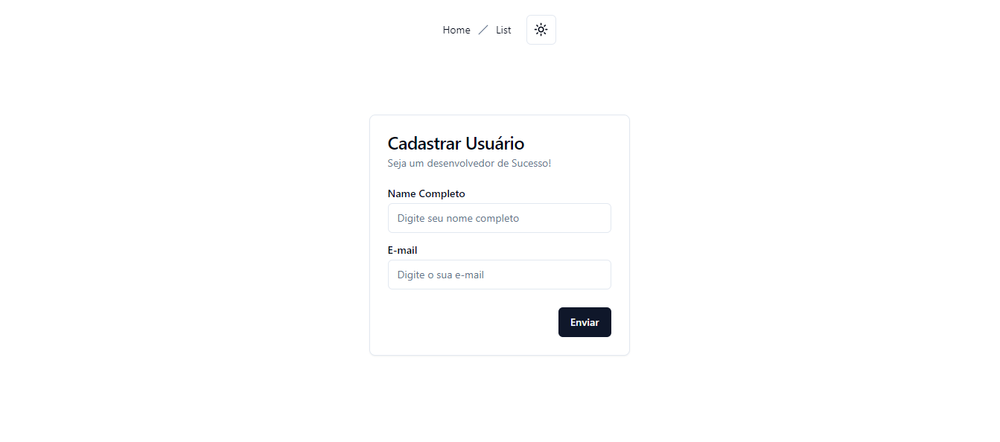
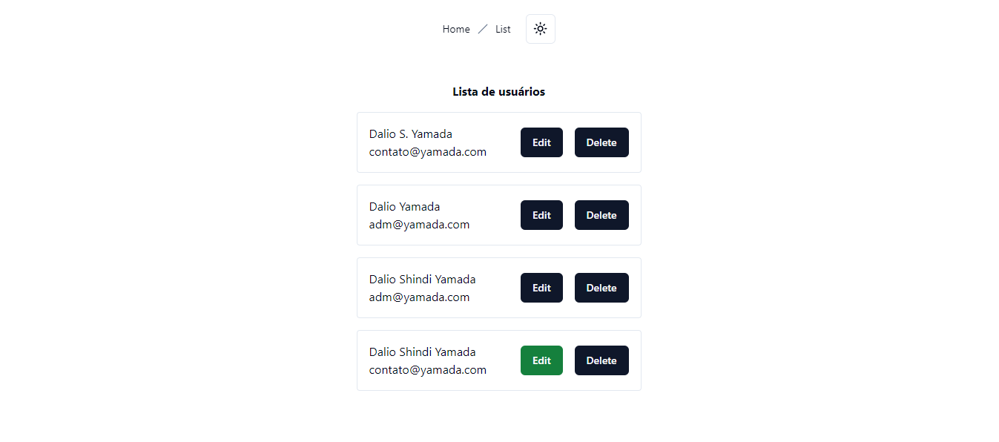

# User Registration

## Índice

- [Visão Geral](#visão-geral)
  - [Imagens](#Imagens)
- [Funcionalidades](#funcionalidades)
- [Tecnologias Utilizadas](#tecnologias-utilizadas)
- [Começando](#começando)
  - [Pré-requisitos](#pré-requisitos)
  - [Instalação](#instalação)
  - [Banco de Dado](#banco-de-dado)
  - [Executando o Projeto](#executando-o-projeto)
- [Deploy](#deploy)
- [Contribuindo](#contribuindo)
- [Contato](#contato)

## Visão Geral

Este projeto é um sistema de registro de usuários que permite a criação, leitura, atualização e exclusão de contas de usuários (CRUD). O sistema foi desenvolvido utilizando Next.js, React.js, Node.js, MongoDB e outras tecnologias, com foco em segurança e usabilidade. O objetivo é proporcionar uma interface intuitiva para que os usuários possam gerenciar suas contas de forma eficiente e segura.

## Imagens

Aqui estão algumas imagens do projeto:

<div>
    
    
    
    
    
    
</div>

## Funcionalidades

- CRUD completo para contas de usuários
- Integrado ao banco de dado
- Design utilizadi do shadcn
- Carregamento rápido

## Tecnologias Utilizadas

- [Next.js](https://nextjs.org/)
- [React.js](https://reactjs.org/)
- [Tailwind_css](https://tailwindcss.com/)
- [shadcn/ui](https://ui.shadcn.com/)
- [Vercel](https://vercel.com/)
- [MongoDB](https://www.mongodb.com/)
- [Node.js](https://nodejs.org/en/)
- [Express.js](https://expressjs.com/pt-br/)
- [Prisma](https://www.prisma.io/)
- [TypeScript](https://www.typescriptlang.org/)

## Começando

### Pré-requisitos

- Node.js (v14.x ou superior)
- npm

### Instalação

1. Clone o repositório:

   ```bash
   git clone https://github.com/DalioSY/user-registration.git
   ```

2. Navegue até o diretório do projeto:

   ```bash
   cd user-registration
   ```

3. Instale as dependências:
   ```bash
   npm install
   ```

### Banco de Dado

1. Criar Cluster no MongoDB Atlas:
   Acesse MongoDB Atlas, faça login, crie um projeto e um cluster.

2. Configurar Usuário e Senha:
   Na seção Database Access, adicione um novo usuário com nome e senha.

3. Obter a String de Conexão:
   No MongoDB Atlas, vá para Clusters, clique em Connect e selecione Connect Your Application para obter a string de conexão.

4. Atualizar e Armazenar a String de Conexão:
   Substitua <username> e <password> na string de conexão e armazene-a com segurança em um arquivo .env, utilizando um formato como:
   ```bash
   MONGODB_API_KEY="mongodb+srv://<username>:<password>@users.tcnbh7v.mongodb.net/Test?retryWrites=true&w=majority"
   ```

### Executando o Projeto

1. Inicie o servidor de desenvolvimento:

   ```bash
   npm run dev
   ```

2. Abra [http://localhost:3000](http://localhost:3000) no seu navegador para ver o projeto.

## Deploy

Este projeto está implantado usando Vercel. Para implantar sua própria versão, você pode seguir estas etapas:

1. Envie seu código para um repositório no GitHub.
2. Vá para [Vercel](https://vercel.com/) e crie um novo projeto.
3. Conecte seu repositório GitHub.
4. Implante seu projeto.

## Contribuindo

Contribuições são bem-vindas! Por favor, siga estas etapas para contribuir:

1. Faça um fork do repositório.
2. Crie uma nova branch (`git checkout -b feature/SuaFuncionalidade`).
3. Faça suas alterações.
4. Faça um commit das suas alterações (`git commit -m 'Adicionei uma nova funcionalidade'`).
5. Envie para a branch (`git push origin feature/SuaFuncionalidade`).
6. Crie um novo Pull Request.

## Contato

- **Dalio Shindi Yamada**
- [GitHub](https://github.com/DalioSY)
- [LinkedIn](https://www.linkedin.com/in/dalio-s-yamada)
- [Portfólio](https://daliosy.github.io/my-PORTFOLIO)
